# Làm quen với Visual Studio | Trở thành .NET Developer - từ 0 tới hero | 03

Visual Studio (VS) là IDE mạnh mẽ và phổ biến cho những LTV (Lập trình viên) .NET. Tuy bạn có thể sử dụng nhiều phần mềm khác nhau (VSCode/Rider), hoặc thậm chí kết hợp giữa CLI và bất kể chương trình nào có thể soạn thảo code được, nhưng VS vẫn luôn là lựa chọn hàng đầu của nhiều người bởi sự miễn phí và những tính năng mà nó mang lại.

> Nếu làm việc cá nhân thì bạn nên sử dụng phiên bản Community, là phiên bản miễn phí của VS

### Khởi động

Sau khi cài đặt, tùy vào tùy chỉnh và phiên bản, có thể bạn sẽ thấy cửa sổ Start Windows hoặc vào trực tiếp VS:

**Start windows**: bên trái là các projects (dự án) gần đây, bên phải là các shortcut chức năng

hoặc sẽ thấy **Visual Studio** blank

### Tạo project

Để tạo project, bạn vào `File > New > Project`

Ở đây bạn sẽ thấy các templates (mẫu dự án) bạn sử dụng gần đây phía bên trái (1), hoặc chọn những templates hỗ trợ phía bên phải. Lưu ý chọn đúng ngôn ngữ (C#) cho project của bạn (2).

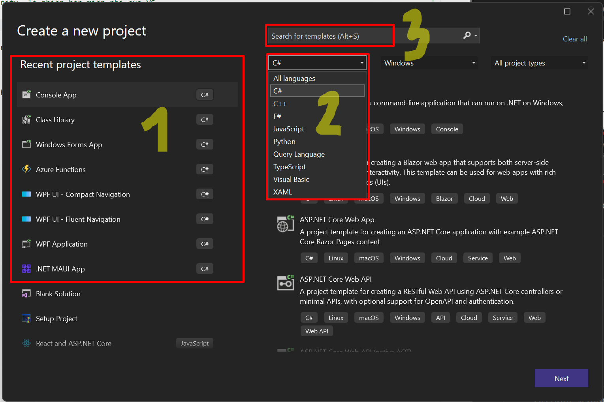

Chọn tên cho project và nơi lưu trữ:

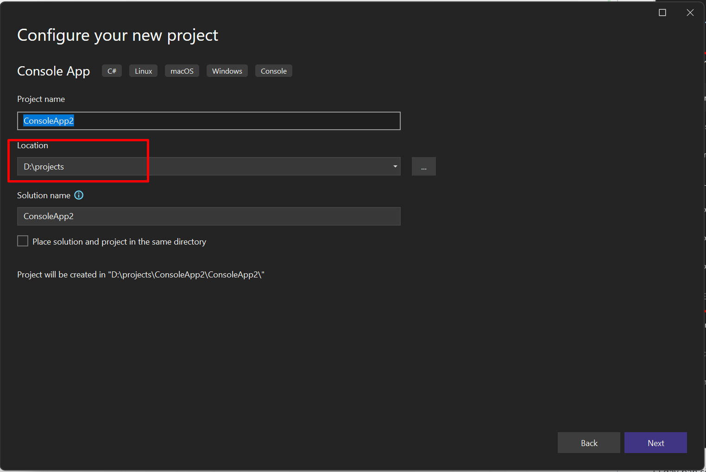

1 vài lưu ý:
- Nên đặt tên project theo cú pháp PascalCase (viết hoa các chữ đầu), và không dùng khoảng trắng (vẫn hợp lệ nhưng nên tránh). Ví dụ:
  - `MyProject` :white_check_mark:
  - `ProductManagement` :white_check_mark:
  - `Product management` :x: sử dụng khoảng trắng
  - `productmanagement` :x: không viết hoa
- Nên chọn "Location" không quá sâu, đường dẫn quá dài sẽ gây lỗi khi mở project.
  - Bạn có thể tùy chọn Location mặc định sau ở menu `Tools > Options > Projects and Solutions > Locations`

Sau khi next, bạn chọn framework cho project. Nếu chưa biết về chỗ này, VS sẽ chọn version stable (ổn định) mới nhất được cài đặt trong máy của bạn.

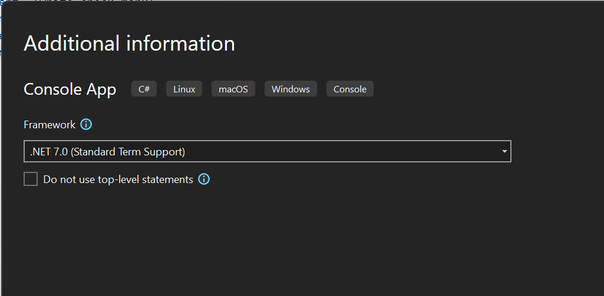

Sau khi thành công, bạn có thể bắt đầu viết và chạy chương trình của mình. Để chạy, bấm `F5` hoặc `Debug > Start Debugging`

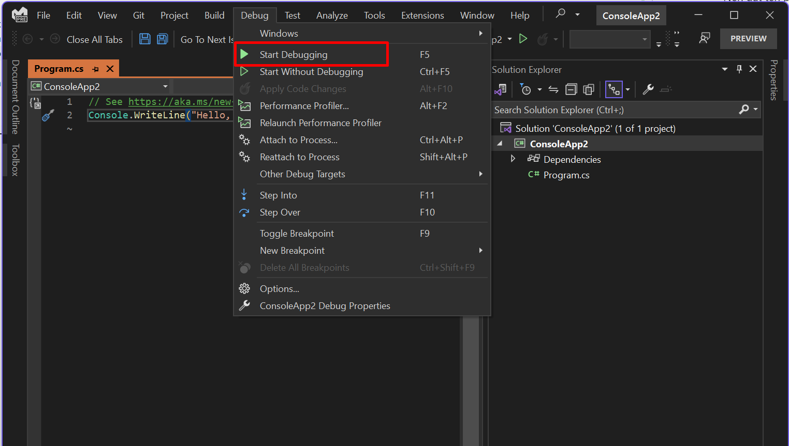

### Các Views thông dụng

Views (đôi khi gọi là windows cũng được) là các tab hiển thị các chức năng tương ứng trong VS. Hầu hết các View đều nằm ở menu `View`. `Solution Explorer` là 1 trong nữa view được sử dụng nhiều nhất.

> Bạn nên nhớ phím tắt của các view thông dụng để dễ dàng mở khi cần

Xem gif dưới đây để biết các thao tác thông thường với view (pin/unpin, snap, resize), tuy nhiên những thao tác này mình rất ít khi sử dụng:

Ngoài ra, đôi khi bạn không tìm thấy view (hoặc bất cứ gì), bạn có thể dùng chức năng tìm kiếm:

### Context menu

> Từ giờ những từ tiếng anh kiểu thế này mình sẽ không dịch nữa, các bạn tự google hen

Context menu sẽ tùy thuộc vào context (nơi bạn bấm chuột phải), sẽ có 3 nơi bạn cần để ý:

**1. Editor context**

Editor context menu chứa những action liên quan tới file bạn đang mở, đôi khi là đoạn code bạn đang highlight.

**2. Project context**

Là menu chứa những action liên quan tới project, như build project (`Build`), thêm mới file vào project (`Add > New Item...`) hoặc chạy ở chế độ debug (`Debug`)

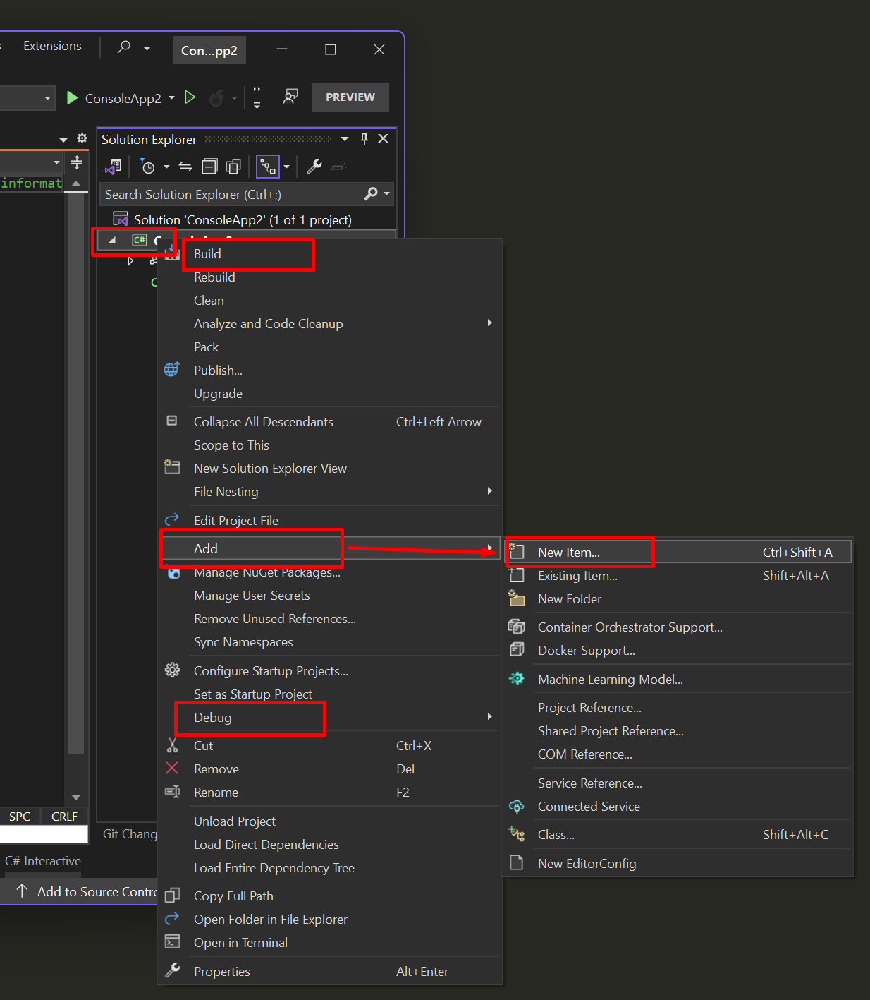

> Lưu ý là right-click vào project name để mở project context menu

**3. Solution context**

Solution có thể chứa nhiều project, ở đây bạn có thể thêm mới project vào solution (`Add > New Project...`), build tất cả projects có trong Solution (`Build Solution`) hoặc thêm những thư viện bên ngoài vào projects (`Manage NuGet Packges for Solution...`)

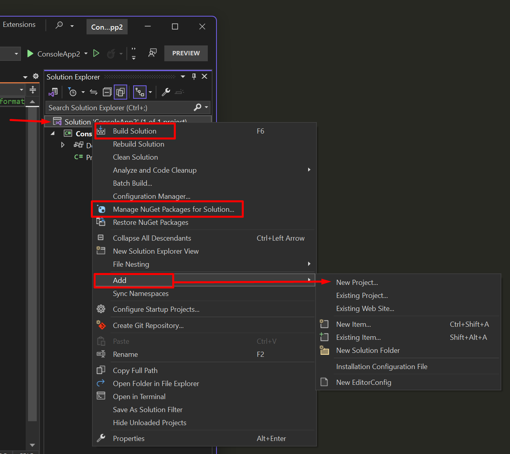

### Các commands thông dụng

**Code search** <kbd>Ctrl</kbd> <kbd>,</kbd> (hoặc <kbd>Ctrl</kbd> <kbd>T</kbd>) là command có thể được xem là sử dụng nhiều nhất. Goto (code search) giúp bạn nhảy đến file/hàm 1 cách nhanh nhất.

**Go To Definition** <kbd>F12</kbd> đi tới nơi định nghĩa của đối tượng đang được chọn (không cần highlight). Trong ví dụ này, khi <kbd>F12</kbd> sẽ nhảy tới chỗ khai báo thuộc tính `Name`. Tương tự thì 2 chức năng bên dưới như tên gọi của nó.

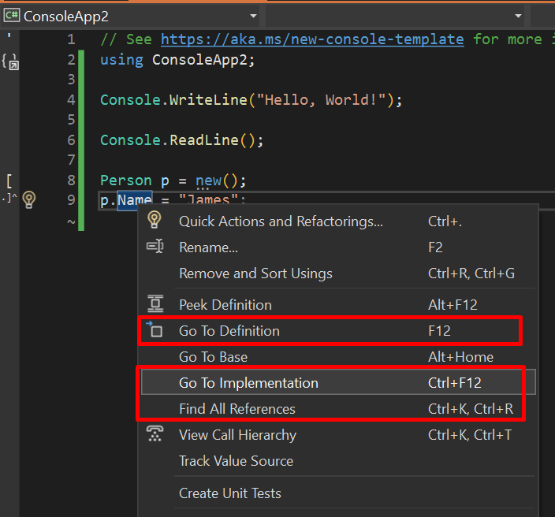

**Debug** <kbd>F5</kbd> chạy project dưới dạng debug. Có 3 cách để run debug:

1. Qua menu `Debug > Start Debugging`
2. Qua debug button trên menu
3. Qua project context menu `Debug > Start New Instance`

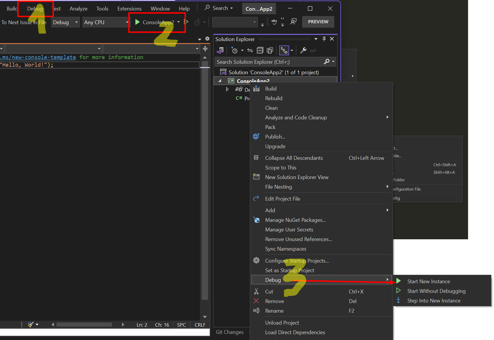

**Build** <kbd>F6</kbd> build code để phát hiện lỗi biên dịch và chuẩn bị debug.

> Run debug cũng sẽ tự động build project

**Navigate** <kbd>Ctrl</kbd> <kbd>-</kbd> **Backward**, <kbd>Ctrl</kbd> <kbd>Shift</kbd> <kbd>-</kbd> **Forward** quay lại vị trí trước đó của con trỏ. Đây là 2 commands khá hữu ích khi làm việc với những file code dài.

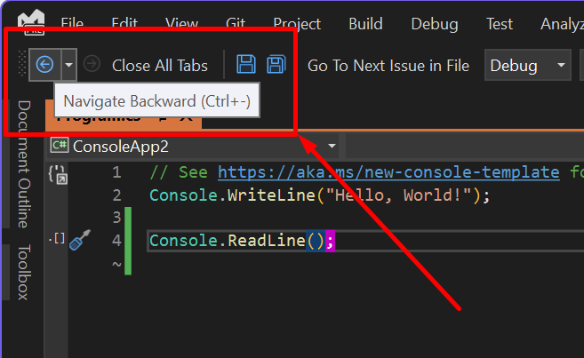

**Commment và bookmark**, bookmark giúp bạn đánh dấu những đoạn code cần quay lại thường xuyên

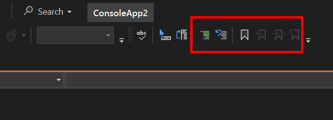

**Format document** <kbd>Ctrl</kbd> <kbd>E</kbd> + <kbd>Ctrl</kbd> <kbd>D</kbd> là command vô cùng hữu dụng để format lại code (canh hàng, canh dấu, xóa whitespaces...). Để bấm phía tắt, giữ phím <kbd>Ctrl</kbd> sau đó bấm <kbd>E</kbd> và <kbd>D</kbd>. Ngoài ra có có icon hình cái chổi phía dưới cũng có thể format được code.

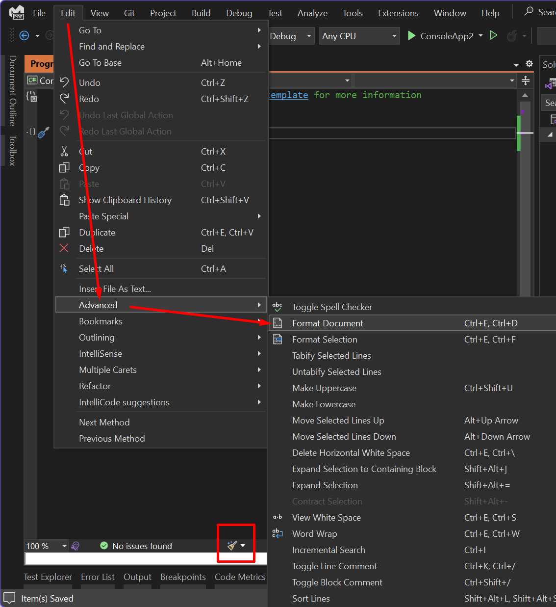

:white_check_mark: Excercies: làm quen với phím tắt và cách hoạt động của nó

Clone repo https://github.com/oclockvn/megax
  - dùng chức năng *Code search* để tìm hàm `RequestLeaveAsync`, sau đó tìm những nơi sử dụng hàm đó (*Find all references*)
  - Đi tới file `AuthController.cs`, sau đó dùng chức năng *Go to definition* và *Go to implementation* cho chỗ gọi hàm `userService.CreateUserAsync`. Phân biệt điểm khác biệt của 2 chức năng.
  - Dùng thử các chức năng comment, bookmark và format document
