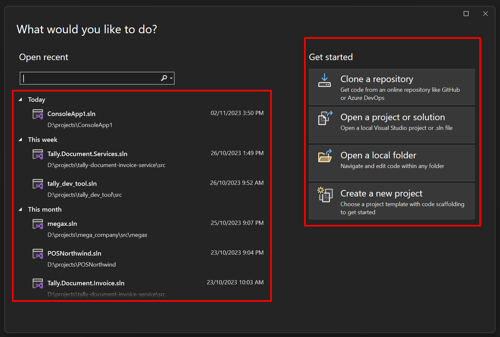
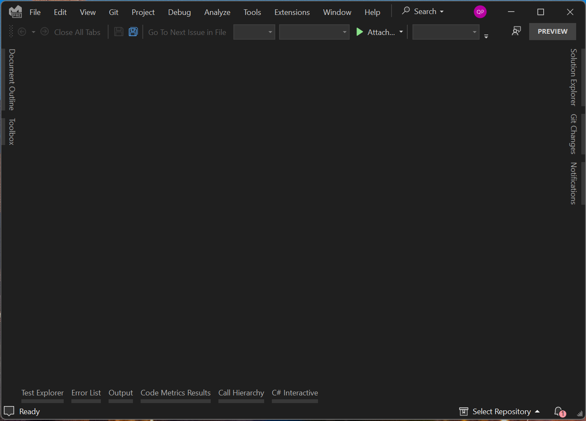
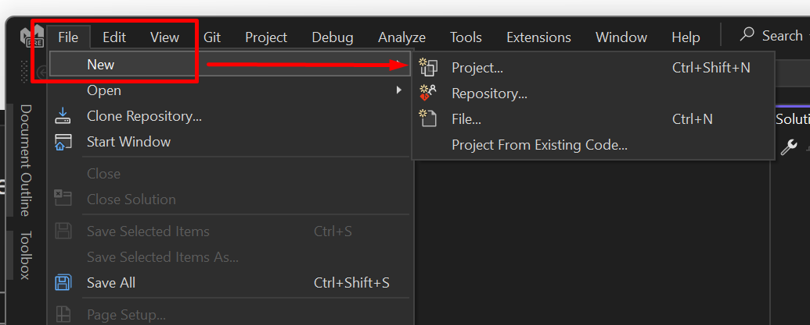
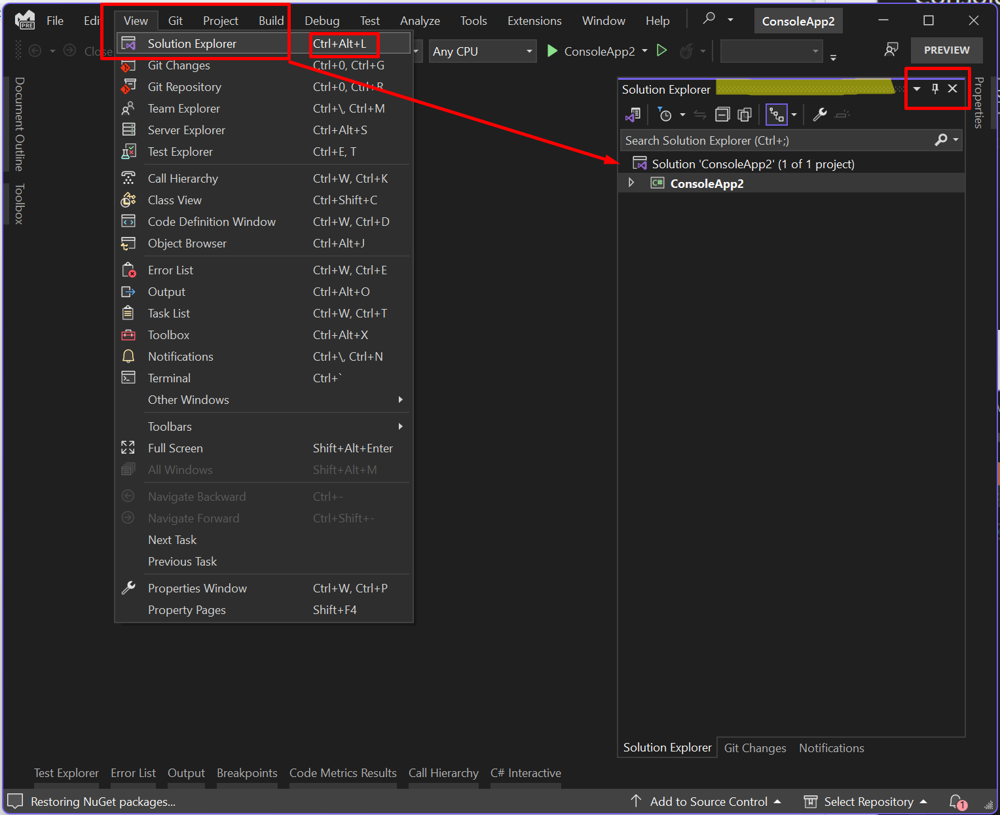
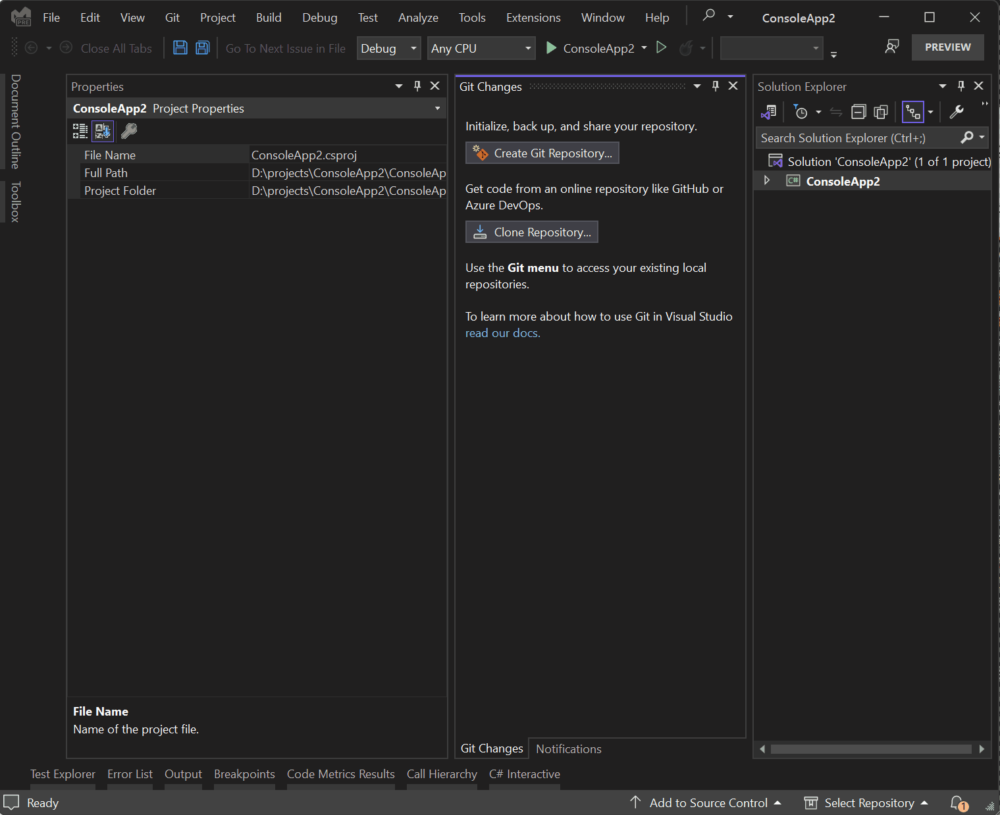
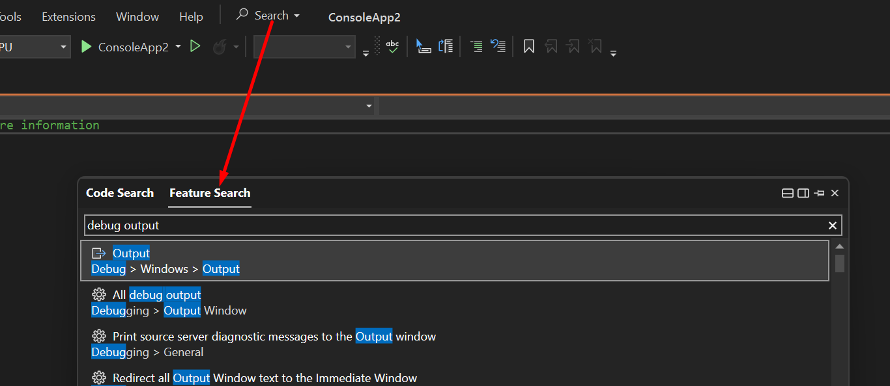
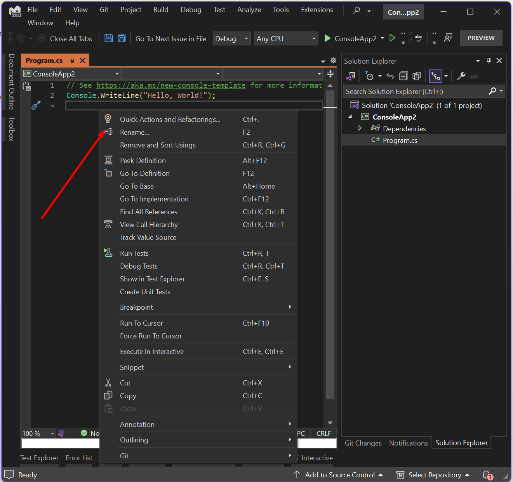

# Làm quen với Visual Studio | Trở thành .NET Developer - từ 0 tới hero | 03

Visual Studio (VS) là IDE mạnh mẽ và phổ biến cho những LTV (Lập trình viên) .NET. Tuy bạn có thể sử dụng nhiều phần mềm khác nhau (VSCode/Rider), hoặc thậm chí kết hợp giữa CLI và bất kể chương trình nào có thể soạn thảo code được, nhưng VS vẫn luôn là lựa chọn hàng đầu của nhiều người bởi sự miễn phí và những tính năng mà nó mang lại.

> Nếu làm việc cá nhân thì bạn nên sử dụng phiên bản Community, là phiên bản miễn phí của VS

### Khởi động

Sau khi cài đặt, tùy vào tùy chỉnh và phiên bản, có thể bạn sẽ thấy cửa sổ Start Windows hoặc vào trực tiếp VS:

**Start windows**: bên trái là các projects (dự án) gần đây, bên phải là các shortcut chức năng

hoặc sẽ thấy **Visual Studio** blank

### Tạo project

Để tạo project, bạn vào `File > New > Project`

Ở đây bạn sẽ thấy các templates (mẫu dự án) bạn sử dụng gần đây phía bên trái (1), hoặc chọn những templates hỗ trợ phía bên phải. Lưu ý chọn đúng ngôn ngữ (C#) cho project của bạn (2).

Chọn tên cho project và nơi lưu trữ:

1 vài lưu ý:
- Nên đặt tên project theo cú pháp PascalCase (viết hoa các chữ đầu), và không dùng khoảng trắng (vẫn hợp lệ nhưng nên tránh). Ví dụ:
  - `MyProject` :white_check_mark:
  - `ProductManagement` :white_check_mark:
  - `Product management` :x: sử dụng khoảng trắng
  - `productmanagement` :x: không viết hoa
- Nên chọn "Location" không quá sâu, đường dẫn quá dài sẽ gây lỗi khi mở project.
  - Bạn có thể tùy chọn Location mặc định sau ở menu `Tools > Options > Projects and Solutions > Locations`

Sau khi next, bạn chọn framework cho project. Nếu chưa biết về chỗ này, VS sẽ chọn version stable (ổn định) mới nhất được cài đặt trong máy của bạn.

Sau khi thành công, bạn có thể bắt đầu viết và chạy chương trình của mình. Để chạy, bấm `F5` hoặc `Debug > Start Debugging`

### Các Views thông dụng

Views (đôi khi gọi là windows cũng được) là các tab hiển thị các chức năng tương ứng trong VS. Hầu hết các View đều nằm ở menu `View`. `Solution Explorer` là 1 trong nữa view được sử dụng nhiều nhất.

> Bạn nên nhớ phím tắt của các view thông dụng để dễ dàng mở khi cần

Xem gif dưới đây để biết các thao tác thông thường với view (pin/unpin, snap, resize), tuy nhiên những thao tác này mình rất ít khi sử dụng:

Ngoài ra, đôi khi bạn không tìm thấy view (hoặc bất cứ gì), bạn có thể dùng chức năng tìm kiếm:

### Context menu

> Chắc từ giờ những từ tiếng anh kiểu thế này mình sẽ không dịch nữa, các bạn tự google hen

Context menu sẽ tùy thuộc vào context (nơi bạn bấm chuột phải), sẽ có 4 nơi bạn cần để ý:

**1. trong editor**

